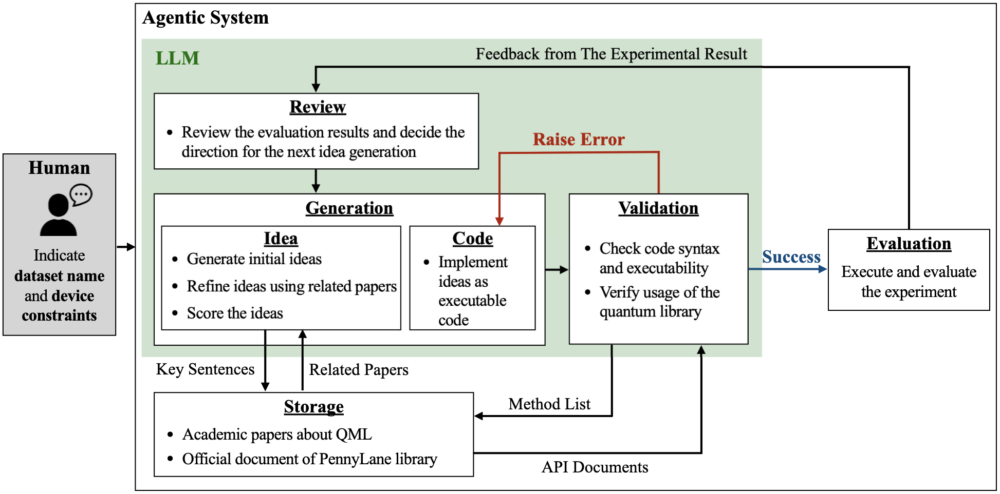

<div align="center">
    <!-- <a href=""> -->
    
    <!-- <h1 align="center">Astronaut</h1> -->
    <!-- </a> -->
</div>

<p align="center">
  This repository contains the official implementation of the paper <a href="https://github.com/Qyusu/astronaut" target="_blank"><em>"Automating quantum feature map design via large language models"</em></a>.
  The system proposed in the paper, named <strong>"Astronaut"</strong>, autonomously generates quantum circuits using an iterative improvement process powered by LLMs. It currently specializes in designing quantum feature maps for machine learning models that rely on kernel methods, such as support vector machines, and is composed of the below architecture.
</p>

<div align="center">
  
</div>

## Table of Contents
- [Requirements](#requirements)
- [Installation](#installation)
- [Configuration](#configuration)
- [Usage](#usage)
- [License](#license)

## Requirements

Our Agentic System requires the following components for execution. An API key for the LLM is only needed for the model being used.

- Python 3.11
- uv (Python package manager)
- OpenAI API Key (optional)
- Google API Key (optional)
- Anthropic API Key (optional)
- Pinecone API Key
- LangSmith API Key (optional)

## Installation

#### 1. Clone the repository:

To begin, please clone our repository into your local development environment.

```bash
git clone https://github.com/Qyusu/astronaut.git
cd astronaut
```

#### 2. Setup Python environment:

Our system has been tested and validated using Python 3.11.
Please note that we have not verified compatibility with other Python versions.
To ensure consistency, we recommend setting up your Python environment using tools such as `pyenv`.

```bash
pyenv install 3.11
pyenv local 3.11
python --version
>> Python 3.11.7
```

#### 3. Install dependencies using uv:

Please install the required libraries, including all dependencies, using `uv`.
If you are not currently using `uv`, you may either refer to the [official documentation](https://docs.astral.sh/uv/getting-started/installation/) for installation instructions, or alternatively, use `pip install -r requirements.txt` to install the dependencies.　However, the use of `requirements.txt` is discouraged, as it only manages top-level libraries.


```bash
# install dependencies by lock file
uv sync

# activate virtual environment
source .venv/bin/activate  # On Windows: .venv\Scripts\activate
```

## Configuration

1. Copy the environment sample file and create your own `.env`:
```bash
cp .env.sample .env
```

2. Configure the following in your `.env` file:

The table below outlines the configuration settings required to run our system.
Settings marked as `Yes` in the "Required" column are mandatory.

Additionally, our system uses [LangSmith](https://www.langchain.com/langsmith) as a tracking service for LLM interactions.
If you do not wish to use this service, please set `"LANGCHAIN_TRACING_V2"` to `false`.

| Type | Name | Required | Description |
|------|------|----------|-------------|
| API Key | OPENAI_API_KEY | No | API key for OpenAI services |
| API Key | GOOGLE_API_KEY | No | API key for Google services |
| API Key | ANTHROPIC_API_KEY | No | API key for Anthropic services |
| API Key | PINECONE_API_KEY | Yes | API key for Pinecone vector database |
| API Key | LANGCHAIN_API_KEY | No | API key for LangSmith tracing |
| Model Setting | CHAT_PLATFORM | Yes | Platform selection: "openai", "google", or "anthropic" |
| Model Setting | DEFAULT_MODEL_VERSION | Yes | Default model version for general tasks. This value will be used when no specific model version is provided |
| Model Setting | IDEA_MODEL_VERSION | No | Model version for idea generation |
| Model Setting | SCORING_MODEL_VERSION | No | Model version for idea scoring tasks |
| Model Setting | SUMMARY_MODEL_VERSION | No | Model version for research paper summarization |
| Model Setting | REFLECTION_MODEL_VERSION | No | Model version for idea reflection tasks |
| Model Setting | CODE_MODEL_VERSION | No | Model version for code generation |
| Model Setting | VALIDATION_MODEL_VERSION | No | Model version for code validation |
| Model Setting | REVIEW_MODEL_VERSION | No | Model version for idea review tasks |
| Model Setting | PARSER_MODEL_VERSION | No | Model version for parsing tasks |
| Embedding Setting | EMBEDDING_PLATFORM | Yes | Platform for embedding generation (currently, only support openai) |
| Embedding Setting | EMBEDDING_MODEL_VERSION | Yes | Version of embedding model |
| Embedding Setting | EMBEDDING_DIM | Yes | Dimension of embeddings |
| Database Setting | PENNLYLANE_INDEX_NAME | Yes | Name of PennyLane index in Pinecone |
| Database Setting | ARXIV_INDEX_NAME | Yes | Name of ArXiv index in Pinecone |
| LangSmith Setting | LANGCHAIN_TRACING_V2 | No | Enable (true)/disable (false) LangSmith tracing |
| LangSmith Setting | LANGCHAIN_ENDPOINT | No | Endpoint for LangSmith service |
| LangSmith Setting | LANGCHAIN_PROJECT | No | Project name in LangSmith |


The configurable LLM providers and model versions for the above settings are listed below. While it may be possible to use unlisted model versions within supported providers, API cost estimation may not function correctly in such cases.

<details><summary>OpenAI</summary>

- [o3-mini](https://platform.openai.com/docs/models/o3-mini)
- [o1-pro](https://platform.openai.com/docs/models/o1-pro)
- [o1](https://platform.openai.com/docs/models/o1)
- [o1-mini](https://platform.openai.com/docs/models/o1-mini)
- [gpt-4.5-preview](https://platform.openai.com/docs/models/gpt-4.5-preview)
- [gpt-4o](https://platform.openai.com/docs/models/gpt-4o)
- [gpt-4o-mini](https://platform.openai.com/docs/models/gpt-4o-mini)
</details>

<details><summary>Google (Gemini)</summary>

- [gemini-2.5-pro-exp](https://ai.google.dev/gemini-api/docs/models?hl=ja#gemini-2.5-pro-preview-03-25)
- [gemini-2.0-pro-exp](https://cloud.google.com/vertex-ai/generative-ai/docs/gemini-v2?hl=ja#2.0-pro)
- [gemini-2.0-flash](https://ai.google.dev/gemini-api/docs/models?hl=ja#gemini-2.0-flash)
- [gemini-2.0-flash-lite](https://ai.google.dev/gemini-api/docs/models?hl=ja#gemini-2.0-flash-lite)
- [gemini-1.5-pro](https://ai.google.dev/gemini-api/docs/models?hl=ja#gemini-1.5-pro)
- [gemini-1.5-flash](https://ai.google.dev/gemini-api/docs/models?hl=ja#gemini-1.5-flash)
- [gemini-1.5-flash-8b](https://ai.google.dev/gemini-api/docs/models?hl=ja#gemini-1.5-flash-8b)
</details>

<details><summary>Anthropic (Claude)</summary>

- [claude-3-7-sonnet](https://docs.anthropic.com/ja/docs/about-claude/models/all-models#)
- [claude-3-5-sonnet](https://docs.anthropic.com/ja/docs/about-claude/models/all-models#)
- [claude-3-5-haiku](https://docs.anthropic.com/ja/docs/about-claude/models/all-models#)
- [claude-3-haiku](https://docs.anthropic.com/ja/docs/about-claude/models/all-models#)
- [claude-3-opus](https://docs.anthropic.com/ja/docs/about-claude/models/all-models#)
</details>


## Usage

"Astronaut" retrieves and utilizes external information from the database during idea evaluation and code validation. Therefore, please ensure that the database is properly set up in advance by following the steps outlined below.

This repository uses [Pinecone](https://www.pinecone.io/) as the default database. However, you may switch to a different database by modifying relevant components such as `astronaut/db/client.py`.

In addition, various runtime parameters that affect API-related costs can be specified as command-line arguments when executing the system. Values used in our study and estimated cost guidelines are also provided, so please use them as a reference.

Please run all commands after changing the current directory with `cd astronaut` from the root directory.

### Setting up PennyLane Documentation

The source code of PennyLane is analyzed to generate reference documentation, which is then stored in the database. This documentation is used during the validation process to ensure that the code generated by the system correctly utilizes PennyLane methods. There are two options for specifying how the source code should be stored, using the `--docs_type` argument. For more details, please refer to the below parameters section.

You can obtain the PennyLane source code by cloning the [official GitHub repository](https://github.com/PennyLaneAI/pennylane). Since method interfaces and other implementation details may vary across versions, please make sure to switch to the desired branch before executing the program described later (For this study, we use version v0.39.0).

```bash
# NOTE: Please make sure you are in the correct directory (astronaut/astronaut) before running any commands.
# Full source code
python3 db/setup_pennylane_db.py --chunk_size=512 --init_db "true" --code_dirc "/source_code/directory/pennylane" --docs_type "source_code"

# Only operator class docs
python3 db/setup_pennylane_db.py --chunk_size=512 --init_db "true" --code_dirc "/source_code/directory/pennylane/ops" --docs_type "class_doc"
```

The following parameters are available for setting up PennyLane documentation:
- `--chunk_size` (integer, required): Size of text chunks for processing documentation. Default is 512.
- `--init_db` (boolean, required): Whether to initialize the database. Set to "true" for first-time setup.
- `--code_dirc` (string, required): Directory path containing PennyLane source code.
- `--docs_type` (string, required): Type of documentation to process. Options:
  - `"source_code"`: Stores the full contents of each file by splitting them into chunks.
  - `"class_doc"`: Extracts classes from each file and stores them in a structured format consisting of the class name and its corresponding docstring.


### Setting up ArXiv Papers

We use the [arXiv API](https://info.arxiv.org/help/api/index.html) to collect PDF data for specific research papers. **When using the arXiv API, please be mindful of the load imposed on the service by limiting the number of papers retrieved per request and ensuring appropriate intervals between requests.**

The PDF files of papers retrieved via the API are also saved in the `"/data/papers/arxiv"` folder within your local environment. These files are referenced during system execution, so please avoid deleting or moving them to a different location.

```bash
# NOTE: Please make sure you are in the correct directory (astronaut/astronaut) before running any commands.
python3 db/setup_arxiv_db.py --chunk_size=1024 --max_results_per_request=100 --init_db "true" --category="quant-ph" --keyword="Quantum Machine Learning" --date_range="20200101-20241231"
```

The following parameters are available for setting up ArXiv papers:
- `--chunk_size` (integer, required): Size of text chunks for processing papers. Default is 1024.
- `--max_results_per_request` (integer, required): Maximum number of papers to retrieve per API request. Default is 100.
- `--init_db` (boolean, required): Whether to initialize the database. Set to "true" for first-time setup.
- `--category` (string, required): arXiv category to search (e.g., "quant-ph" for quantum physics).
- `--keyword` (string, required): Search keyword for papers (e.g., "Quantum Machine Learning").
- `--date_range` (string, required): Date range for paper search in format "YYYYMMDD-YYYYMMDD".

**Important Notes:**
- The request interval is set to 5 seconds in the source code to avoid excessive load on the arXiv API.
- Unless you have a specific reason to modify this value, we recommend leaving it unchanged.


### Running Experiments

Once the database configuration is complete, you will be able to run the agentic system and begin your experiments.
Please note that using the system will incur API usage costs for the LLM.
Be sure to review and adjust the available runtime parameters to manage these costs effectively.

The parameter that has the most significant impact on cost is "max_trial_num", which defines the maximum number of experiment iterations.
As a reference, running the system with the models and parameters described in the README results in an estimated cost of approximately $15 (1 trial $0.5).

```bash
# NOTE: Please make sure you are in the correct directory (astronaut/astronaut) before running any commands.
python3 main.py --experiment_name "20250405" --desc "This is a first experiment. Parameter xx set to xx ..." --max_trial_num=30 --max_idea_num=2 --max_suggestion_num=3 --max_reflection_round=3
```

The following parameters are available for running experiments:
- `--experiment_name` (string, required): Name of the experiment. Used for organizing results and logs.
- `--desc` (string, required): Description of the experiment. Helps identify the purpose of the experiment.
- `--max_trial_num` (integer, required): Maximum number of trials to run. Each trial represents a complete iteration of the experiment.
- `--max_idea_num` (integer, required): Maximum number of ideas to generate per trial. Controls the breadth of exploration.
- `--max_suggestion_num` (integer, required): Maximum number of suggestions to generate per idea. Controls the depth of exploration for each idea.
- `--max_reflection_round` (integer, required): Maximum number of reflection rounds per suggestion. Controls how many times the system can refine its approach.

## License
This project is licensed under the terms specified in the [LICENSE](LICENSE) file.
